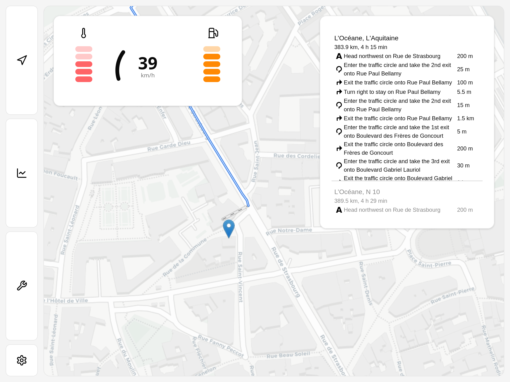
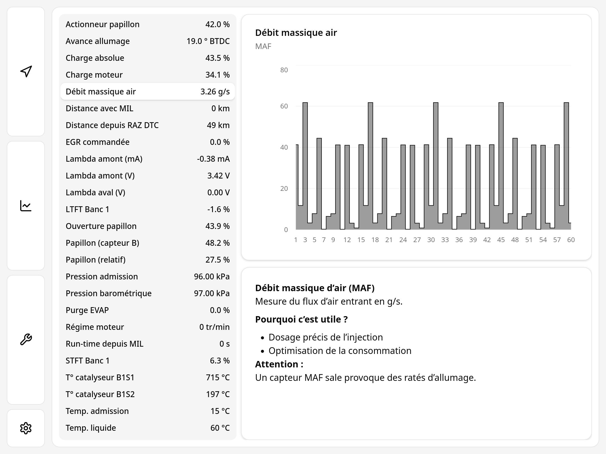
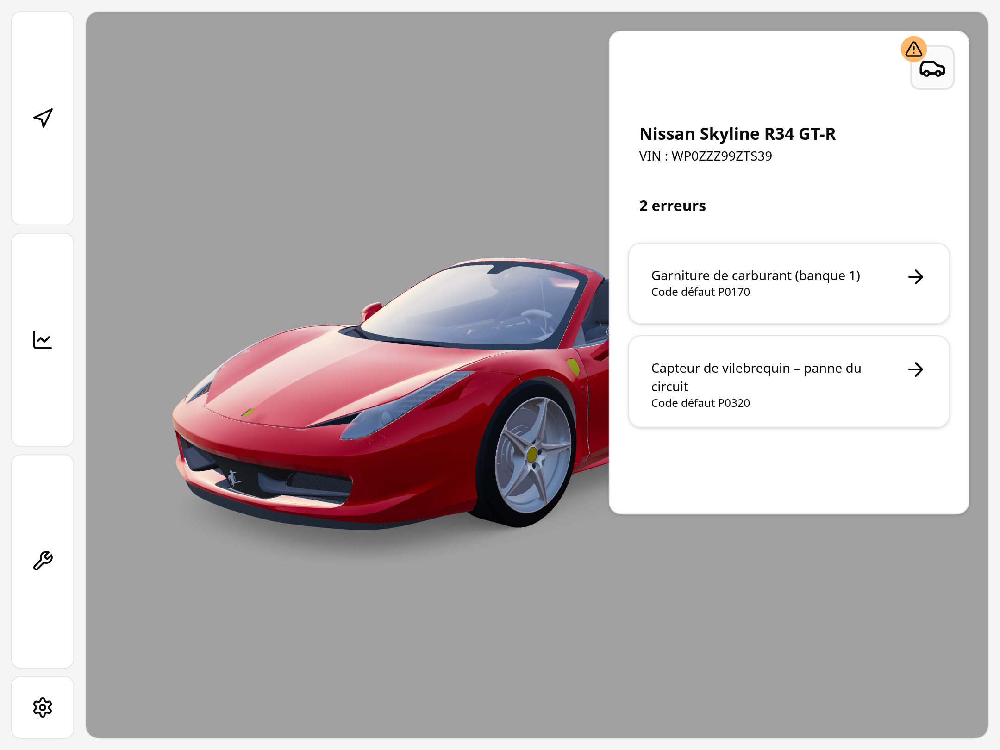
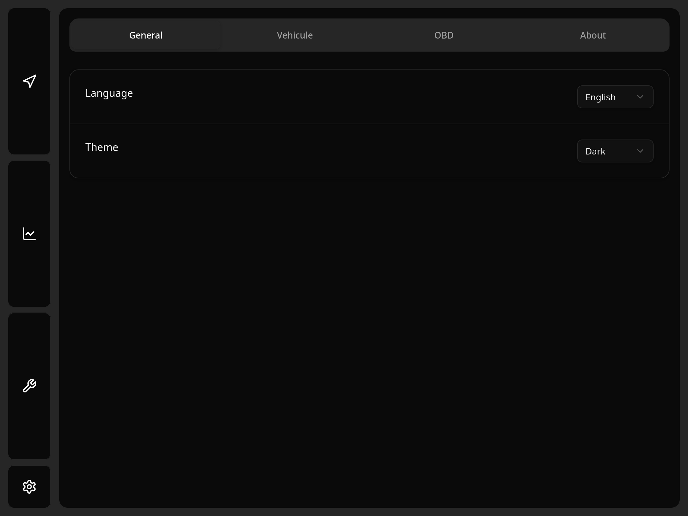

# obd-dashboard

Onboard car dashboard with GPS, real-time diagnostics and errors from the electronic embedded system OBD data.

## TL;DR
Run `obd-dashboard-python` instructions, then `obd-dashboard-next`.

## Screenshots

Dashboard with GPS and real-time data from OBD-II.

Real-time OBD-II data.

Error codes from OBD-II data of the ECU.

Settings page to change theme, language and preferences.
